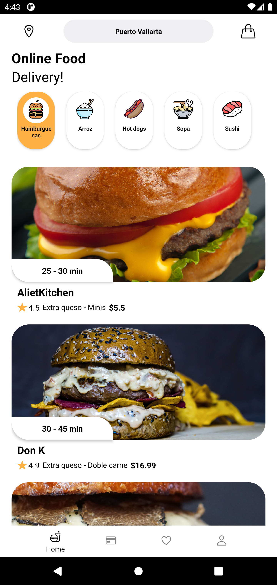
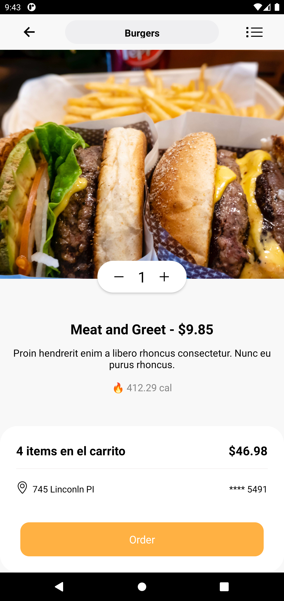

## Food Ordering & Delivery App UI in React Native 
___


#### This application is not completed yet. Currently, I am working on it 👷🏾‍♂️.

___

##### 📱 A small attempt to make an Food delivery app user interface in ReactNative for Android.


___

### Screenshots 📷
___

<div style="display: flex">
}


</div>

____


## 📚 Some of the libraries used in this project are:
- React CLI
- React navigation
- React-native-vector-icons
- Axios
- Pending
    - React-native-maps
    - React-native-community/geolocation

___

### Note: API built with Strapi 🚀
___

### ✨ Requirements 
- Any Operating System (ie. MacOS X, Linux, Windows)

- A little knowledge of Javascript and React
- A brain to think 🤓

___

🚧 Don't forget to rebuild the **node_modules**:

```
npm i
```