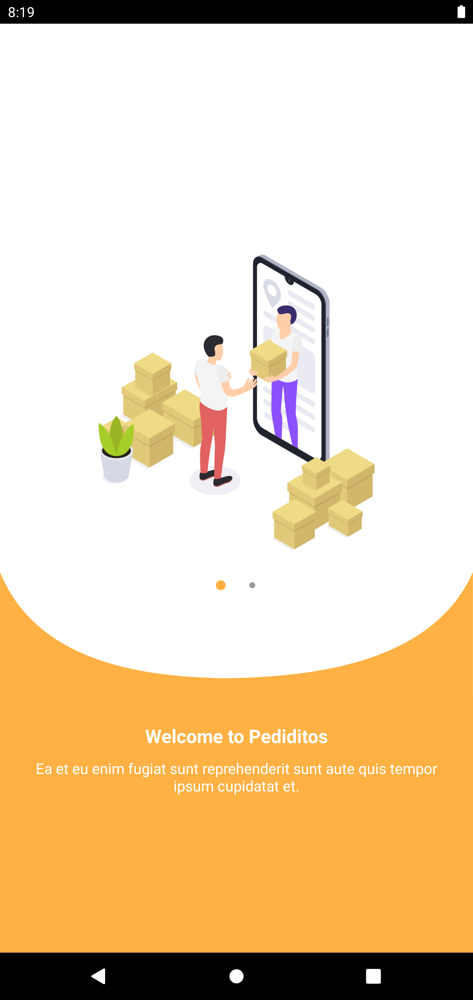
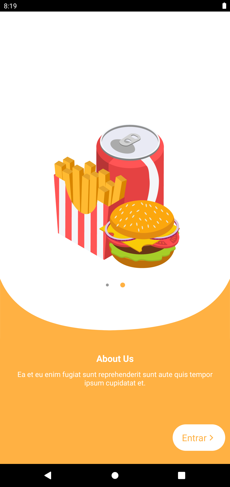
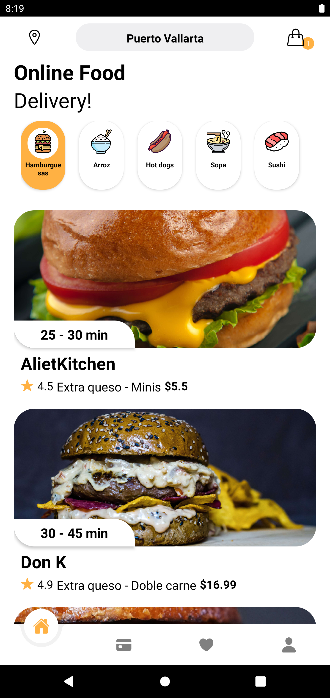

## Food Ordering & Delivery App UI in React Native

#### This application is not completed yet. Currently, I am working on it 👷🏾‍♂️.

##### 📱 A small attempt to make an Food delivery app user interface in ReactNative for Android.

### Screenshots 📷

<div style="display: flex; margin-bottom: 10px">




</div>

<div style="display: flex">




</div>

---

## 📚 Some of the technologies used in this project are:

- React-native-snap-carousel
- React-native-vector-icons
- React Native CLI
- React navigation
- React-Redux
- Redux
- Axios
- Pending
  - React-native-maps
  - React-native-community/geolocation

---

### Note: API built with Strapi 🚀

---

### ✨ Requirements

- Any Operating System (ie. MacOS X, Linux, Windows)

- A little knowledge of Javascript and React
- A brain to think 🤓

🚧 Don't forget to rebuild the **node_modules**:

```
npm i
```
